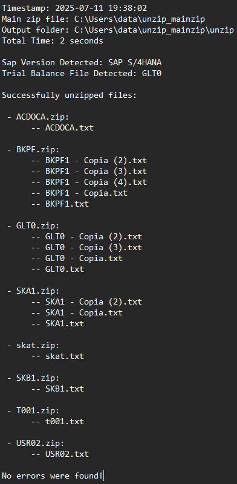
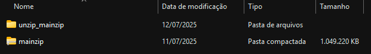
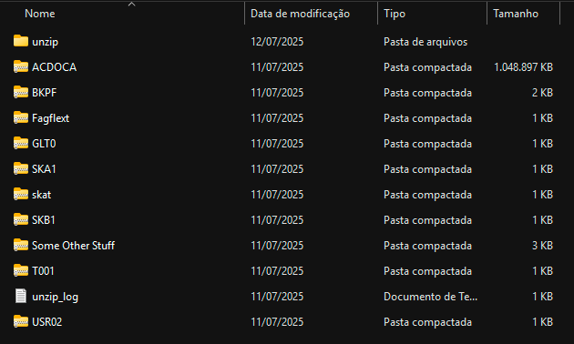
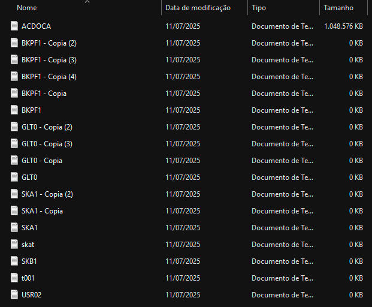
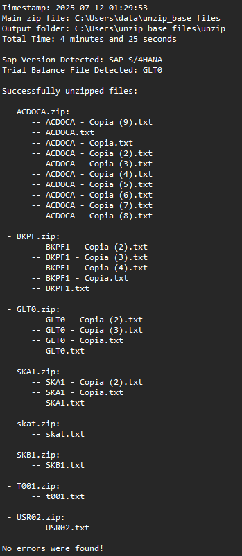
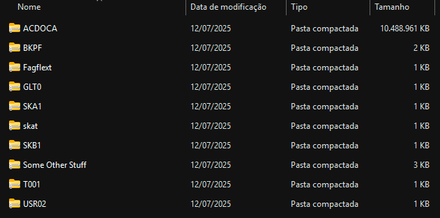
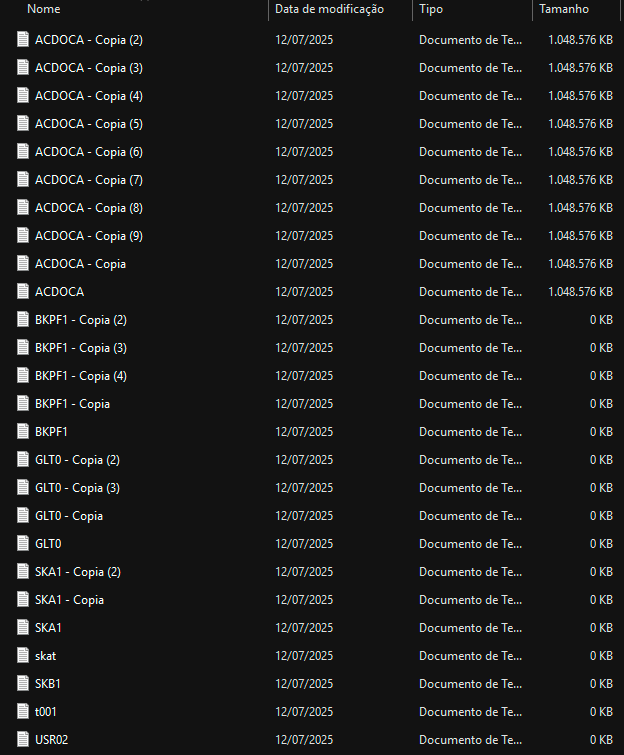

# Unzip-SAP-Files
Is a python application designed to extract `.zip` files generated by SAP systems.

Based on the files provided it can detect the SAP version (ECC or S/4HANA), extracts relevant files (most commom files -which can be edited in the src/utils/keywords.py file), ignores corrupted files and generate an extraction log.

## How Does It Work?
- **Input**: The user passes the path to the main `zip` file.
- **First Unizp**: The main `.zip` file is unzipped into a folder named `unzip_<filename>`.
- **Selecting Files To Unzip**: It checks the inner `zip` files for matches in the keyword list.
- **SAP Version**: It checks wether the archive contains SAP ECC (`BSEG`) or SAP S/4HANA (`ACDOCA`) files.
- **Trial Balance**: If both `GLT0` and `FAGFLEXT` trial balance files are found, only the larger one is extracted — following typical business rules.
- **Unzipps Selectec Files**: After applying all rules, the selected `.zip` files are extracted. Only `.txt` files are saved, ignoring subfolders.
- **Creates Log File**: A full `unzip_log.txt` is created in the parent folder.
- **All Done**: Go to the output folder and enjoy your files.

## Why Use It?
- **Complete Extraction Guarantee**: Every relevant `.zip` file is scanned and all `.txt` files are extracted — no data left behind.
- **Fast and Efficient**: The script is optimized to handle large volumes of files and nested folders without performance issues.
- **Clean Output Structure**: All extracted `.txt` files are centralized in a single output folder — no subfolders.
- **Detailed Extraction Log**: Generates a complete log file.
- **Peace of Mind**: With structured logging and consistent output, this tool is ideal for automation, auditing, or compliance. purposes.

## Features
- Detects the SAP version (ECC or S/4HANA).
- Only extracts files based on keywords (e.g., `BSEG`, `ACDOCA`, `BKPF`, etc...).
- Compares trial balance files (`GLT0` vs `FAGFLEXT`) and extracts only the larger one.
- Extracts only `.txt` files, ignoring folders and other file types into the same unzip folder.
- No external libraries required - uses only Python standard library.

## Log Features
- Generates a log file with:
  - Timestamp.
  - Original ZIP path.
  - Output folder path.
  - Extracted files (grouped by zip source).
  - Any errors encountered.
  - Total execution time.
  - SAP version and trial balance used.

## Project Structure
```plaintext
root/
├── src/
│   └──logs/
│   │   └── unzipLog.py
│   └── models/
│   │   └── unzipGLFiles.py
│   └── utils/
│       ├── keywords.py
│       ├── unzipMainFile.py
│       ├── userInput.py
│       └── keywords.py
└── main.py
```

## How to Use
1. **Clone the repository:**

```bash
git clone https://github.com/BrCOS/python-unzip-sap-files.git
cd python-unzip-sap-files
```

2. **Run the main.py file:**

```bash
python main.py
```

3. **Paste the file path:**

If you are on windows 10:
```bash
Shift + right-click on the file and look for 'Copy as Path' in the menu
```

If you are on windows 11:
```bash
Right-click on the file and look for 'Copy as Path' or press Ctrl + Shift + C
```

4. **Enjoy**

## Tests
- **1GB Zip File**:

To test the performance, a `.zip` file containing a 1GB ACDOCA `.txt` file was used, the remaining keywords were empty `txt` files.



Result: The file was successfully extracted in just 2 seconds on a standard SSD.

- The parent directory:



- Inside the unzip_mainzip directory:



- Inside the unzip directory (only the selected files were unzipped):




- **10GB Zip File**:

To test the performance, ten `.zip` files containing a 1GB ACDOCA `.txt` each were used, the remaining keywords were empty `txt` files.



Result: The file was successfully extracted in less than 5 minutes on a standard SSD.

- The parent directory:



- Inside the unzip_mainzip directory:


## Disclaimer
The accuracy and completeness of the extracted files may depend on how the original `.zip` files were generated by the client's SAP system or third-party extractors. Additionally, the naming conventions, file structure, and content may vary according to internal business rules and policies defined by each company.

This tool provides a general solution and may require customization to meet specific organizational standards or data extraction workflows.